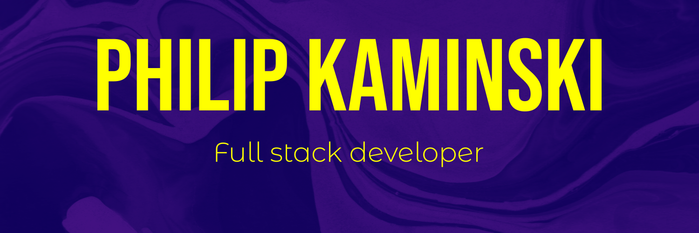

# 👋 Hello :)

Hey, my name's Philip. I'm a junior full stack software developer and recent Psychology BSc graduate who believes there are more ways than one to help those around us. I combine a passion for creating beautiful, functional, innovative and accessible designs with a love for data, problem-solving and scientific approach. I have just finished the amazing School of Code bootcamp where I spent 16 weeks pair-programming in Agile teams and delivering neat software (you can check it out below).  
 
Make sure to check out my [portfolio website](https://www.philip-kaminski.tech/), download <a href="./assets/PK_CV.pdf" target=”_blank”>My CV</a> and connect with me on [LinkedIn](https://www.linkedin.com/in/kaminskp/).
 
 
 

# 📚 My stack

 

 

 
  
 
 
 

# 🚀 My journey

### April '22

 

 
### June '22

 

 
### July '22

 

 
### August '22

 

 
### September '22
  
 

 
### November '22

 

 
### Currently working on:

 

# 📈 Github stats

 
 
 

<!---
AureaFlamma/AureaFlamma is a ✨ special ✨ repository because its `README.md` (this file) appears on your GitHub profile.
You can click the Preview link to take a look at your changes.

