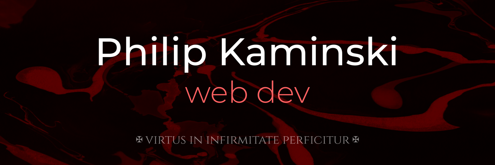

# 👋 Hello :)

My name's Philip. I'm a buddying web developer and a recent graduate of [School Of Code](https://www.schoolofcode.com/). Artistic by nature, I tend to gravitate towards the visual aspects of the front end. However, I also find backend fascinating, in line with the interest in data and statistics which I took away from my Psychology BSc degree. 
 
Make sure to check out my [portfolio website](https://www.philip-kaminski.tech/) and download <a href="./assets/PK_CV.pdf" download>My CV</a>.
 
 
 

# 📚 My stack

 

 

 
  
 
 
 

# 🚀 My journey

### April '22

 
⬇️
 
### June '22

 
⬇️
 
### July '22

 
⬇️
 
### August '22

 

# 📈 Github stats

<!--This can be used to create a new theme- just fork the repo-->

]
 
 
 

<!---
AureaFlamma/AureaFlamma is a ✨ special ✨ repository because its `README.md` (this file) appears on your GitHub profile.
You can click the Preview link to take a look at your changes.

PLAN:
1. Deploy Tribute
2. Readme for Tribute

3. Deploy Mindactivity
4. Readme for mindactivity

5. Deploy Squatify
6. Readme for Squatify

7. Portfolio website
8. Photo
--->
